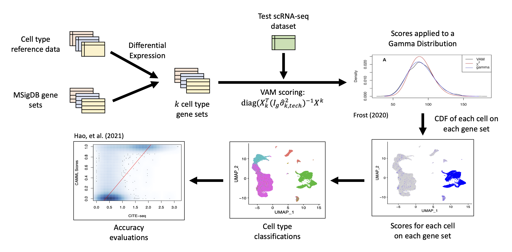

# Summary

Cell typing is a critical task in the analysis of single cell transcriptomics data. Unfortunately, cell typing is typically performed at the level of cell clusters using techniques that only support single-label classification, which ignores within cluster heterogeneity and the fact that many cell types exist on a spectrum. We developed the CAMML (Cell-typing using Variance-Adjusted Mahalanobis distances with Multi-Labeling) method and R package to support gene set-based, multi-label cell typing of individual cells profiled via single cell RNA-sequencing.

# Statement of need

Single-cell RNA-sequencing (scRNA-seq) has notably expanded the capabilities of transcriptome analysis [@aldridge_single_2020;@svensson_exponential_2018;@kolodziejczyk_technology_2015;@wagner_single-cell_2019;@zeisel_brain_2015]. However, this experimental technique generates sparse and noisy data, which makes downstream statistical analysis challenging. To mitigate sparsity and noise, scRNA-seq analysis typically focuses on mean gene expression in cell clusters. While a cluster-level analysis can provide biologically important information, the results reflect the state of the average cell in each cluster, obscuring within cluster heterogeneity. To support a cell-level rather than cluster-level analysis, we previously developed the Variance-adjusted Mahalanobis (VAM) method for gene set scoring of individual cells in scRNA-seq data [@frost_variance-adjusted_2020]. We recently expanded on the VAM method to support weighted gene sets and multi-label cell type classification using our new method, Cell-typing using Variance-Adjusted Mahalanobis distances with Multi-Labeling (CAMML) [@schiebout_camml_2022]. In this application note, we outline the updated VAM algorithm that allows for positive gene weights and introduce the CAMML package, which supports multi-label cell typing of scRNA-seq data using either prebuilt or user-generated gene sets representing cell types of interest [@frost_variance-adjusted_2020;@schiebout_camml_2022;@r_core_team_r_nodate].

The VAM method computes cell-level gene set scores using the squared value of a modified Mahalanobis multivariate distance that is measured from the origin rather than mean and adjusts for only the technical variance of the genes in each set rather than the full sample covariance matrix [@frost_variance-adjusted_2020]. These squared modified Mahalanobis distances are computed on both the original scRNA-seq data and data where the cell labels are permuted to break inter-gene correlation. To determine a null distribution for these distances, a gamma distribution is fit to the non-zero distances for the permuted data. Scores for each cell are computed using this null distribution by finding the cumulative distribution function (CDF) value for the non-permuted squared distances resulting in a score from 0 to 1 for each cell. These scores are robust to large values, can be compared between gene sets of different sizes and can be subtracted from 1 to generate valid p-values under the null of uncorrelated technical noise [@frost_variance-adjusted_2020]. To allow for prioritization of particular genes in a given set, we updated VAM to accept positive gene weights [@frost_variance-adjusted_2020;@schiebout_camml_2022]. These gene weights are used to modify the technical variance for each gene by dividing the original technical variance estimate by the associated gene weight [@schiebout_camml_2022]. This adjustment prioritizes genes with large weights by reducing the associated variance penalty in the modified Mahalanobis distance computation. For the CAMML method, gene-level weights are used to prioritize genes that are highly characteristic of a cell type (i.e. CD8a in CD8+ T-cells) in the computation of VAM scores for cell type gene sets [@frost_variance-adjusted_2020;@schiebout_camml_2022]. Support for gene weights is included in the 1.1.0 version of the VAM R package, which is available on CRAN. 

Building on the weighted version of VAM, we developed the CAMML method and associated R package for multi-label cell typing of scRNA-seq data [@schiebout_camml_2022]. CAMML uses the weighted version of VAM to compute cell-level scores for gene sets representing cell types. These cell type-specific gene sets are defined to include both genes differentially expressed (DE) in the cell type as well as genes annotated to one of the MSigDB C8 [@liberzon_molecular_2011] gene sets associated with that cell type. The inclusion criteria and associated weight for DE genes is based on either the log-fold change in expression in the target cell type relative to other cell types or the -log(p-value) from the edgeR [@robinson_edger_2010] DE test. These genes are then intersected with the associated MSigDB C8 cell-type collection to designate the final gene set. Gene sets are available in the CAMML R package for 23 cell types; details regarding the process for creating these cell type gene sets is included in the package vignette. The CAMML R package also supports the creation of custom cell type gene sets based on the DE analysis of a user specified cell-type reference dataset [@robinson_edger_2010]. These cell type gene sets can then be scored for a query scRNA-seq dataset using the weighted VAM algorithm outlined above and these scores can be leveraged to classify cells as desired [@frost_variance-adjusted_2020;@schiebout_camml_2022]. This customization allows for users to choose the labeling method that best fits the needs of their study. The pipeline for CAMML can be seen in Figure 1 and implemented in the package on CRAN at https://cran.r-project.org/package=CAMML.

To validate the CAMML R package, joint scRNA-seq and Cellular Indexing of Transcriptomes and Epitopes by Sequencing (CITE-seq) data was accessed from Hao, et al (2021) [@hao_integrated_2021;@stoeckius_simultaneous_2017]. The inclusion of CITE-seq in this data allows for a benchmarking method for cell-typing according to the expression of cell-surface protein markers [@stoeckius_simultaneous_2017]. CAMML was run on approximately 57,000 of the highest quality cells produced with 3’ scRNA-seq to allow for improved visualization and scalability [@hao_integrated_2021;@satija_spatial_2015;@hafemeister_normalization_2019]. We ran CAMML cell typing on 5 immune cell types of interest (B cells, T cells, monocytes, hematopoietic stem cells (HSCs), and NK cells) using gene sets available in the CAMML package and visualized the weighted VAM scores relative to the corresponding CITE-seq measurements (example for monocytes in bottom left panel of Fig. 1) [@schiebout_camml_2022;@hao_integrated_2021]. Weighted VAM scores and CITE-seq expression were positively correlated in cases where they represented the same cell type (with an average R2 of 0.56) and either not correlated or negatively correlated in cases where they did not (with an average R2 of -0.09). This analysis is available as a vignette in the CAMML package.

In conclusion, we developed weighted VAM and CAMML, both of which are available as R packages through CRAN, to support weighted gene set scoring and cell typing of scRNA-seq data. Together, these methods allow for customizable gene set development, cell-specific weighted gene set scoring, and single- or multi-label cell-typing. Validation of these methods has been based on the analysis of joint scRNA-seq/CITE-seq data, which showed that the cell type scores generated by CAMML are consistent with the abundance of cell surface markers. These methods allow for both the accurate characterization of scRNA-seq data and multi-label cell typing, which can detect cells in states of transition or phenotypic ambiguity.

# References

